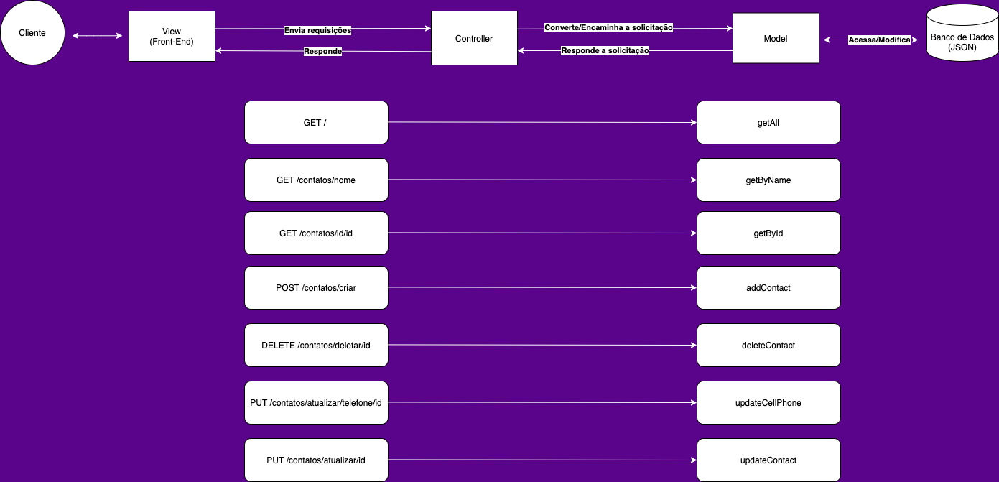

### Projeto 3 do Bootcamp da [{Reprograma}](https://reprograma.com.br/)
# API de Agenda de contatos

## Dados do projeto
Essa API reúne os contatos da agenda do usuário. <br>
Utilizei como ferramentas: `Node.js`, `Express`, `Nodemon`, `Cors`, `Mongoose`.


#### **Dados da Collection**

- id: autogerado e obrigatório
- nome: texto e obrigatório
- celular: texto e obrigatório
- dataNascimento: data e obrigatório
- fotoPerfil: texto e não obrigatório

#### **Rotas a serem retornadas:**

 - `"/"` Retorna index com apresentação.
 - `"/contatos/"` Retorna todos os dados do banco de dados.
 - `"/contatos/criar"` Cria novo contato e retorna mensagem.
 - `"/contatos/nome/[NOME]"` Retorna contato por nome específico. (Utiliza **Query Parameters**)
 - `"/contatos/id/[ID]"` Retorna contato por id específico. 
 - `"/contatos/deletar/[ID]"` Deleta contato por id específico e retorna mensagem. 
 - `"/contatos/atualizar/telefone/[ID]"` Atualiza somente telefone do contato por id específico e retorna mensagem. Não permite que modifique nenhum outro item.
 - `"/contatos/atualizar/[ID]"` Atualiza completamente contato e retorna mensagem.

### Arquitetura



*Representação visual/diagrama das camadas do Backend*

 ### Padrão MVC
```
 📁 api
   |
   |-  📁 src
   |    |  
   |    |- 📁 controller
   |    |- 📁 models
   |    |- 📁 routes
   |    |- 📄 app.js
   |
   |- 📄 package.json 
   |- 📄 server.js
```


#### Dúvidas ou curiosidades?
nathaliacsan@gmail.com